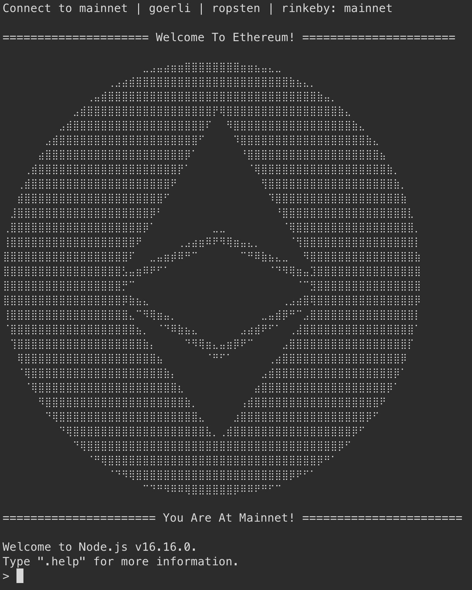

# 0xEthPortal - Ethereum Console Clone-To-Go
## Hardhat Console pre-configs ready to launch

[](https://github.com/briannnyee/0xEthPortal)  



Don't need to know a thing about Hardhat. 0xEthPortal pre-configures Hardhat Console for you. No more googling. Clone the repo, fill in secrets, and you can enjoy

- Cool lookings when fires the terminal
- Convenient usage thanks to Hardhat
- Select either, or both `ethers.js` and `web3.js`

## Installation

0xEthPortal requires Hardhat.

Install the dependencies

```sh
npm install
```

## Fill in secrets

Rename `secrets-example.json` to `secrets.json` 
```sh
mv ./secrets-example.json ./secrets.json
```

Fill in secrets.json <br>

| Secrets | Description |
| ------ | ------ | 
| MNEMONICS | Your 12 words mnemonics |
| PRIVATE_KEY | Your account private key. The corresponding account is used to connect to the network |
| INFURA_API_KEY | 0xEthPortal uses [Infura](https://infura.io/) as provider. [Alchemy](https://www.alchemy.com) can serve as alternative but manually replacing urls in `hardhat.config.js` is required |
| IMPORT_WEB3 | Default `false`. Set to `true` to enable web3.js 
| ETHERSCAN_API_KEY | Optional |

⚠️ Double-check the `.gitignore` file to prevent leaking secrets accidentally

## Activate the Portal!

Depends on the local-machine shell,

- for zsh
```sh
npm run eth
```
- for bash
```sh
npm run eth-bash
```

The message should prompt out
```sh
Connect to mainnet | goerli | ropsten | rinkeby: 
```

Type in, and the cool looking ether should appear on the screen!

## Use Mnemonic

0xEthPortal defaults to use **1** account only. To obtain multiple accounts, use MNEMONIC in hardhat.config.js.

1. open `hardhat.config.js`
2. Find commented `accounts: {MNEMONIC: MNEMONIC}`
3. Uncomment `accounts: {MNEMONIC: MNEMONIC}` and comment `accounts: [PRIVATE_KEY]`
4. Restart 0xEthPortal

You're granted multiple accounts in 0xEthPortal

## Use Alchemy

0xEthPortal defaults to [Infura](https://infura.io/). If you prefer [Alchemy](https://www.alchemy.com), follow the steps below

1. open `hardhat.config.js`
2. Scroll down to `networks` (line 28)
3. Find corresponding network, replace `url` with your Alchemy API url
4. Restart 0xEthPortal